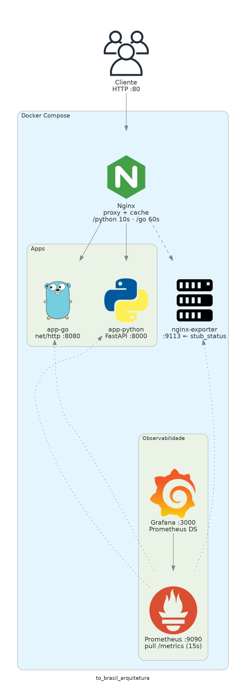

# Desafio DevOps 2025 — T.O Brasil

Duas aplicações web em **linguagens diferentes** (Python/FastAPI e Go/net/http), atrás de **Nginx** como reverse proxy com **cache com TTLs distintos**, orquestradas com **Docker Compose**, com **observabilidade** (Prometheus, Grafana, nginx-prometheus-exporter) e **dashboards** provisionados.

## Diagrama da arquitetura




**Fluxo de métricas do Nginx:** o **nginx-prometheus-exporter** faz *pull* HTTP ao endpoint **`stub_status`** do Nginx; o **Prometheus** faz scrape do exporter (e das apps em `/metrics`). Detalhes, diagrama em ASCII, fluxos de atualização e sugestões de melhoria estão em [`docs/architecture.md`](docs/architecture.md).

## Pré-requisitos

- Docker e Docker Compose (plugin `compose` v2)

## Como executar

Um comando sobe toda a infra:

```bash
docker compose up --build -d
```

## Endpoints HTTP

| Rota | Descrição | Cache (Nginx) |
|---|---|---|
| `http://localhost/python/` | Texto fixo (Python) | 10s |
| `http://localhost/python/time` | Horário do servidor (Python) | 10s |
| `http://localhost/go/` | Texto fixo (Go) | 60s |
| `http://localhost/go/time` | Horário do servidor (Go) | 60s |

O header **`X-Cache-Status`** indica `HIT`, `MISS`, `STALE`, etc.

## Observabilidade

| Serviço | URL | Papel |
|---|---|---|
| Prometheus | http://localhost:9090 | Coleta de métricas (scrape) |
| Grafana | http://localhost:3000 | Dashboards (usuário/senha padrão: **admin/admin** — trocar em ambiente real) |

O Prometheus coleta:

- **app-python** — `/metrics` via `prometheus-fastapi-instrumentator`
- **app-go** — `/metrics` via `prometheus/client_golang` (HTTP instrumentado)
- **nginx-exporter** — métricas derivadas do **`stub_status`** do Nginx (o exporter consulta o Nginx; em seguida o Prometheus consulta o exporter em `:9113`)

No Grafana, pasta **To Brasil** (provisionada):

- **TO Brasil — Aplicações** — taxas e latência HTTP (Python e Go)
- **TO Brasil — Nginx** — requests, conexões e estados (`reading` / `writing` / `waiting`)

## Estrutura do projeto

```
.
├── app-python/ # FastAPI
│   ├── main.py
│   ├── requirements.txt
│   └── Dockerfile
├── app-go/                     # net/http
│   ├── main.go
│   ├── go.mod
│   └── Dockerfile
├── nginx/
│   └── nginx.conf              # Proxy reverso + cache
├── prometheus/
│   └── prometheus.yml
├── grafana/
│   └── provisioning/
│       ├── dashboards/
│       │   ├── dashboards.yml
│       │   └── json/
│       │       ├── apps.json
│       │       └── nginx.json
│       └── datasources/
│           └── prometheus.yml
├── architecture-diagram/       # Diagrama “as code” + PNG
│   ├── architecture.py
│   ├── requirements.txt
│   ├── README.md
│   └── to_brasil_arquitetura.png
├── docs/
│   └── architecture.md         # Análise, melhorias, fluxos de atualização
├── docker-compose.yml
└── README.md
```
